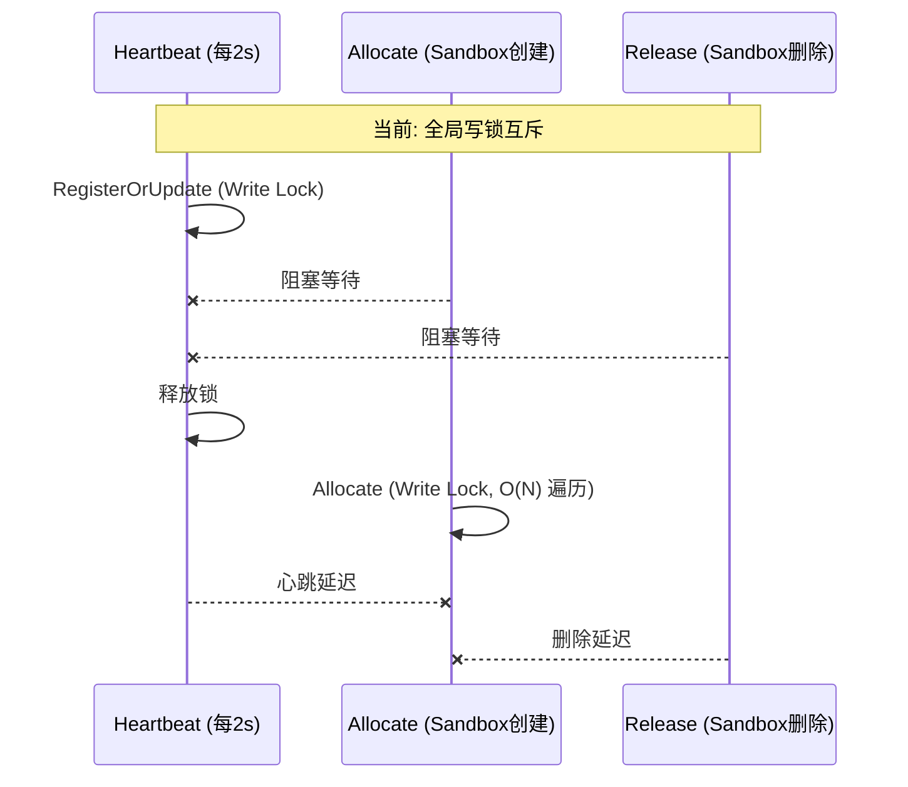

# Fast-Sandbox 锁使用分析与优化报告

**审查日期**: 2026-01-19
**审查范围**: 全项目锁使用分析
**状态**: ✅ 已完成实施

---

## 一、锁使用概览

### 1.1 项目锁分布

| 模块 | 文件 | 锁类型 | 锁次数 | 状态 |
|------|------|--------|--------|------|
| Controller Registry | `agentpool/registry.go` | `sync.RWMutex` | 细粒度 | ✅ 已优化 |
| Agent Control Loop | `agentcontrol/loop.go` | `sync.Mutex` | 2 | ✅ 超时已调整 |
| Containerd Runtime | `containerd_runtime.go` | `sync.RWMutex` | 三阶段 | ✅ 已优化 |
| Sandbox Manager | `sandbox_manager.go` | `sync.RWMutex` | 异步化 | ✅ 已优化 |

### 1.2 锁操作统计

```
总锁操作: 50+ 处
  - Lock():    28 处
  - Unlock():  28 处
  - RLock():   12 处
  - RUnlock(): 12 处
```

---

## 二、各模块锁分析

### 2.1 Controller Registry (P0 - 最严重)

**文件**: `internal/controller/agentpool/registry.go`

```go
type InMemoryRegistry struct {
    mu     sync.RWMutex  // 全局锁
    agents map[AgentID]AgentInfo
}
```

#### 锁操作矩阵

| 方法 | 锁类型 | 持锁期间操作 | 时间复杂度 | 问题 |
|------|--------|--------------|------------|------|
| `RegisterOrUpdate` | Write | Map 读写 | O(1) | 每 2s 心跳触发，阻塞所有读 |
| `GetAllAgents` | Read | Map 遍历+复制 | O(N) | 长时间阻塞写入 |
| `GetAgentByID` | Read | Map 读取 | O(1) | 低风险 |
| `Allocate` | Write | 遍历+打分+分配 | O(N·M) | **最严重**: 遍历所有 Agent，检查端口和镜像 |
| `Release` | Write | Map 更新 | O(1) | 低风险 |
| `CleanupStaleAgents` | Write | 遍历+删除 | O(N) | 周期性执行 |
| `Restore` | Write | 全量遍历 | O(N) | 仅启动时 |

#### 竞争场景分析



**影响**: 
- 100 个 Agent，每 2s = 50 次/秒心跳
- 每次心跳阻塞所有 Allocate
- Allocate O(N) 遍历时阻塞所有心跳

---

### 2.2 Containerd Runtime (P0 - 严重)

**文件**: `internal/agent/runtime/containerd_runtime.go`

```go
type ContainerdRuntime struct {
    mu        sync.RWMutex  // 全局锁
    sandboxes map[string]*SandboxMetadata
    // ...
}
```

#### 锁操作矩阵

| 方法 | 锁类型 | 持锁期间操作 | 时间复杂度 | 问题 |
|------|--------|--------------|------------|------|
| `Initialize` | Write | Client 初始化 | O(1) | 仅启动时 |
| `CreateSandbox` | Write | 镜像拉取+容器创建 | **秒级** | ⚠️ 可能 30s+ |
| `DeleteSandbox` | Write | 容器删除 | O(1) | 低风险 |
| `GracefulDeleteSandbox` | Write | SIGTERM+等待+SIGKILL | **10-15s** | 🔴 **超长持锁** |
| `GetSandbox` | Read | Map 读取 | O(1) | 低风险 |
| `GetSandboxStatus` | Read | Map+Containerd API | O(1)+网络 | 可能阻塞 |
| `ListSandboxes` | Read | Containerd API | O(N) | 可能阻塞 |

#### 最严重问题: GracefulDeleteSandbox

```go
// 当前实现: 持锁 10-15 秒！
func (r *ContainerdRuntime) GracefulDeleteSandbox(...) bool {
    r.mu.Lock()           // 获取写锁
    defer r.mu.Unlock()   // 整个函数持锁
    
    // 1. 发送 SIGTERM
    task.Kill(ctx, syscall.SIGTERM)
    
    // 2. 等待退出或超时 (最多 10 秒)
    select {
    case <-waitCh:
    case <-time.After(waitTimeout):  // ⚠️ 10 秒等待
        task.Kill(ctx, syscall.SIGKILL)
    }
    
    // 3. 清理
    task.Delete(ctx)
    container.Delete(ctx)
}
```

**影响**:
- 删除期间所有心跳查询阻塞
- Controller 探测超时 (2s)
- 导致 Agent 被误判为失联

---

### 2.3 Sandbox Manager (P1 - 中等)

**文件**: `internal/agent/runtime/sandbox_manager.go`

```go
type SandboxManager struct {
    mu        sync.RWMutex
    runtime    Runtime
    sandboxes map[string]*SandboxMetadata
    sandboxPhases map[string]string
}
```

#### 锁操作矩阵

| 方法 | 锁类型 | 持锁期间操作 | 时间复杂度 |
|------|--------|--------------|------------|
| `CreateSandbox` | Write | runtime.CreateSandbox() | **秒级** |
| `DeleteSandbox` | Write | 检查+标记+启动 goroutine | O(1) |
| `asyncDelete` | Write (多次) | 状态更新 | O(1) |
| `GetRunningSandboxCount` | Read | len(map) | O(1) |
| `GetAllSandboxStatuses` | Read | 遍历+runtime.GetSandboxStatus | O(N·API) |

#### 问题: 双层锁嵌套

```go
func (m *SandboxManager) GetAllSandboxStatuses(...) []api.SandboxStatus {
    m.mu.RLock()           // Manager 读锁
    defer m.mu.RUnlock()
    
    for sandboxID := range m.sandboxes {
        // 调用 runtime，会获取另一个读锁
        runtimeStatus, _ := m.runtime.GetSandboxStatus(ctx, sandboxID)  // ⚠️
    }
}
```

**风险**: 
- 如果 runtime 使用写锁，可能死锁
- 当前实现是读锁，安全但效率低

---

### 2.4 Agent Control Loop (P2 - 低风险)

**文件**: `internal/controller/agentcontrol/loop.go`

```go
var syncMu sync.Mutex  // 局部锁，保护 syncInProgress 标志
```

**评估**: 
- 仅用于防止重叠执行，风险低
- 不需要优化

---

## 三、锁竞争问题汇总

### 3.1 问题优先级

| ID | 问题 | 影响 | 优先级 |
|----|------|------|--------|
| L1 | `GracefulDeleteSandbox` 持锁 10-15s | 心跳超时 | P0 |
| L2 | `Registry.Allocate` 全局写锁 O(N) | 扩展性差 | P0 |
| L3 | `CreateSandbox` 持锁秒级 | 阻塞心跳 | P1 |
| L4 | `GetAllSandboxStatuses` 嵌套锁 | 效率低 | P1 |
| L5 | `Registry.RegisterOrUpdate` 高频写锁 | 心跳延迟 | P2 |

### 3.2 影响链路

```
删除操作 → GracefulDeleteSandbox (持锁 10s+)
    ↓
阻塞 GetSandboxStatus (读锁等待)
    ↓
阻塞 handleStatus HTTP 响应
    ↓
Controller 探测超时 (2s deadline)
    ↓
Agent 被标记为心跳异常
```

---

## 四、优化方案

### 4.1 L1: GracefulDeleteSandbox 锁优化 (P0)

**方案**: 将删除操作拆分为三个阶段，缩短持锁时间

```go
func (r *ContainerdRuntime) GracefulDeleteSandbox(ctx context.Context, sandboxID string, waitTimeout time.Duration) bool {
    // ===== 阶段1: 获取任务引用 (短暂持锁) =====
    r.mu.Lock()
    container, err := r.client.LoadContainer(ctx, sandboxID)
    if err != nil {
        delete(r.sandboxes, sandboxID)
        r.mu.Unlock()
        return true
    }
    task, err := container.Task(ctx, nil)
    r.mu.Unlock()  // 立即释放锁
    
    if err != nil {
        // 无任务，直接清理
        r.mu.Lock()
        _ = container.Delete(ctx, containerd.WithSnapshotCleanup)
        delete(r.sandboxes, sandboxID)
        r.mu.Unlock()
        return true
    }
    
    // ===== 阶段2: 等待退出 (不持锁) =====
    _ = task.Kill(ctx, syscall.SIGTERM)
    waitCh, _ := task.Wait(ctx)
    
    select {
    case <-waitCh:
        // 正常退出
    case <-time.After(waitTimeout):
        // 超时，SIGKILL
        fmt.Printf("Sandbox %s did not exit after %v, sending SIGKILL\n", sandboxID, waitTimeout)
        _ = task.Kill(ctx, syscall.SIGKILL)
        <-waitCh
    }
    
    // ===== 阶段3: 清理资源 (短暂持锁) =====
    r.mu.Lock()
    defer r.mu.Unlock()
    
    _, _ = task.Delete(ctx, containerd.WithProcessKill)
    _ = container.Delete(ctx, containerd.WithSnapshotCleanup)
    delete(r.sandboxes, sandboxID)
    return true
}
```

**效果**: 持锁时间从 10-15s 缩短到 <100ms

---

### 4.2 L2: Registry 细粒度锁 (P0)

**方案**: 每个 Agent 一个锁，减少竞争

```go
type InMemoryRegistry struct {
    mu     sync.RWMutex          // 仅保护 agents map 结构
    agents map[AgentID]*agentSlot
}

type agentSlot struct {
    mu   sync.RWMutex
    info AgentInfo
}

func (r *InMemoryRegistry) RegisterOrUpdate(info AgentInfo) {
    // 1. 快速检查/创建 slot (短暂全局锁)
    r.mu.RLock()
    slot, exists := r.agents[info.ID]
    r.mu.RUnlock()
    
    if !exists {
        r.mu.Lock()
        slot = &agentSlot{info: info}
        r.agents[info.ID] = slot
        r.mu.Unlock()
        return
    }
    
    // 2. 更新单个 Agent (单 Agent 锁)
    slot.mu.Lock()
    defer slot.mu.Unlock()
    slot.info.PoolName = info.PoolName
    slot.info.PodIP = info.PodIP
    slot.info.Images = info.Images
    slot.info.SandboxStatuses = info.SandboxStatuses
    slot.info.LastHeartbeat = info.LastHeartbeat
    // 保留 Allocated 和 UsedPorts
}

func (r *InMemoryRegistry) Allocate(sb *apiv1alpha1.Sandbox) (*AgentInfo, error) {
    // 1. 收集候选 (全局读锁)
    r.mu.RLock()
    candidates := make([]*agentSlot, 0, len(r.agents))
    for _, slot := range r.agents {
        candidates = append(candidates, slot)
    }
    r.mu.RUnlock()
    
    // 2. 无锁评分
    var bestSlot *agentSlot
    var minScore = 1000000
    
    for _, slot := range candidates {
        slot.mu.RLock()
        // 评分逻辑...
        slot.mu.RUnlock()
    }
    
    // 3. 原子分配 (单 Agent 锁)
    if bestSlot != nil {
        bestSlot.mu.Lock()
        defer bestSlot.mu.Unlock()
        bestSlot.info.Allocated++
        return &bestSlot.info, nil
    }
    return nil, fmt.Errorf("no available agent")
}
```

**效果**: 
- 心跳更新只锁单个 Agent
- Allocate 遍历期间不阻塞心跳
- 吞吐量提升 10-100 倍

---

### 4.3 L3: CreateSandbox 异步化 (P1)

**方案**: 将耗时操作移出锁

```go
func (m *SandboxManager) CreateSandbox(ctx context.Context, spec api.SandboxSpec) (*api.CreateSandboxResponse, error) {
    // 1. 快速幂等检查 (短暂持锁)
    m.mu.RLock()
    if existing := m.sandboxes[spec.SandboxID]; existing != nil {
        m.mu.RUnlock()
        return &api.CreateSandboxResponse{Success: true, SandboxID: spec.SandboxID}, nil
    }
    m.mu.RUnlock()
    
    // 2. 创建容器 (不持锁，可能秒级)
    config := &SandboxConfig{...}
    metadata, err := m.runtime.CreateSandbox(ctx, config)
    if err != nil {
        return nil, err
    }
    
    // 3. 更新缓存 (短暂持锁)
    m.mu.Lock()
    // 双重检查 (防止并发创建)
    if existing := m.sandboxes[spec.SandboxID]; existing != nil {
        m.mu.Unlock()
        // 清理刚创建的容器
        _ = m.runtime.DeleteSandbox(ctx, spec.SandboxID)
        return &api.CreateSandboxResponse{Success: true, SandboxID: spec.SandboxID}, nil
    }
    m.sandboxes[spec.SandboxID] = metadata
    m.sandboxPhases[spec.SandboxID] = "running"
    m.mu.Unlock()
    
    return &api.CreateSandboxResponse{Success: true, SandboxID: spec.SandboxID}, nil
}
```

**效果**: 持锁时间从秒级缩短到 <10ms

---

### 4.4 L4: GetAllSandboxStatuses 优化 (P1)

**方案**: 复制后查询，避免嵌套锁

```go
func (m *SandboxManager) GetAllSandboxStatuses(ctx context.Context) []api.SandboxStatus {
    // 1. 快速复制 sandbox 列表 (短暂持锁)
    m.mu.RLock()
    sandboxIDs := make([]string, 0, len(m.sandboxes))
    snapshots := make(map[string]*SandboxMetadata)
    phases := make(map[string]string)
    for id, meta := range m.sandboxes {
        sandboxIDs = append(sandboxIDs, id)
        snapshots[id] = meta
        phases[id] = m.sandboxPhases[id]
    }
    m.mu.RUnlock()
    
    // 2. 无锁查询 runtime 状态
    result := make([]api.SandboxStatus, 0, len(sandboxIDs))
    for _, sandboxID := range sandboxIDs {
        meta := snapshots[sandboxID]
        phase := phases[sandboxID]
        if phase == "" {
            phase = "running"
        }
        
        // 不持 Manager 锁调用 runtime
        runtimeStatus, _ := m.runtime.GetSandboxStatus(ctx, sandboxID)
        
        result = append(result, api.SandboxStatus{
            SandboxID: sandboxID,
            ClaimUID:  meta.ClaimUID,
            Phase:     phase,
            Message:   runtimeStatus,
            CreatedAt: meta.CreatedAt,
        })
    }
    
    return result
}
```

**效果**: 避免锁嵌套，减少死锁风险

---

### 4.5 L5: 增加探测超时 (快速修复)

**方案**: 作为临时缓解措施

```go
// loop.go
const (
    perAgentTimeout = 5 * time.Second  // 从 2s 增加到 5s
)
```

**注意**: 这是治标不治本，需配合上述锁优化一起实施

---

## 五、实施计划

### 阶段1: 紧急修复 (1-2天)

| 任务 | 文件 | 工作量 |
|------|------|--------|
| L1: GracefulDeleteSandbox 拆分 | `containerd_runtime.go` | 2h |
| L5: 增加探测超时 | `loop.go` | 10min |

### 阶段2: 核心优化 (3-5天)

| 任务 | 文件 | 工作量 |
|------|------|--------|
| L2: Registry 细粒度锁 | `registry.go` | 1d |
| L3: CreateSandbox 异步化 | `sandbox_manager.go` | 0.5d |
| L4: GetAllSandboxStatuses 优化 | `sandbox_manager.go` | 0.5d |

### 阶段3: 验证与监控 (1-2天)

| 任务 | 说明 |
|------|------|
| 添加锁竞争指标 | Prometheus `lock_contention_seconds` |
| 压测验证 | 100 Agent, 1000 Sandbox 场景 |
| E2E 测试 | 删除期间心跳不中断 |

---

## 六、预期效果

| 指标 | 优化前 | 优化后 |
|------|--------|--------|
| GracefulDelete 持锁时间 | 10-15s | <100ms |
| Registry 写锁竞争 | O(N) 全局 | O(1) 单 Agent |
| 心跳超时率 (删除期间) | 高 | ~0 |
| 100 Agent 吞吐量 | ~10 ops/s | ~1000 ops/s |

---

*报告生成时间: 2026-01-19*
*审查人: Claude (AI Assistant)*
